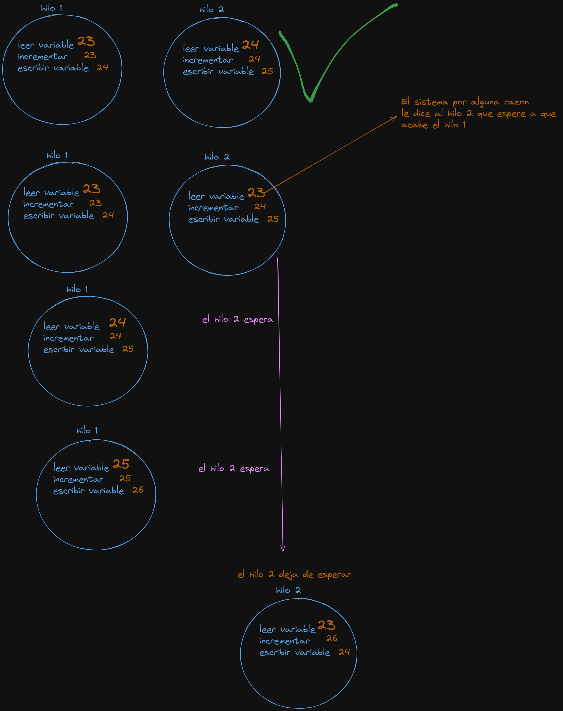

# LAS RACE CONDITIONS 

## [ANTES QUE NADA EL VIDEO DONDE APRENDI YO TODO ESTO](https://youtu.be/FY9livorrJI?si=cKhMW47I3A3AuPnd)

- Con los hilos tenemos un problema que voy a dejar aqui
materializado para acordarme siempre de esto.

- El problema viene cuando dos hilos intentan acceder a la misma variable, uno puede que vaya mas rapido que el otro y mientras que hacemos que uno espere puede que esa variable haya cambiado de cuando le llego a ese hilo y es donde radica el problema veamos:

# [main de ejemplo](srcs/dataraces.c)

```c
#include "../includes/philo.h"

void *sumar(void *arg)
{
    int *data = (int *)arg;
    int i = 0;
    while (i < 1000000)
    {
        *data = *data + 1;
        i++;
    }
    return (NULL);
}

int main(int ac, char **av)
{
    (void)ac;
    (void)av;
    int data = 0;

    printf("proyecto Hilos\n");
    pthread_t thread;
    pthread_t thread2;
    if (pthread_create(&thread, NULL, sumar, &data) != 0)
        printf("Error al crear el hilo\n");
    if (pthread_create(&thread2, NULL, sumar, &data) != 0)
        printf("Error al crear el hilo\n");    
    if (pthread_join(thread, NULL) != 0)
        printf("Error al esperar por el hilo\n");
        
    if (pthread_join(thread2, NULL) != 0)
        printf("Error al esperar por el hilo\n");
    printf("el valor de data es %d\n", data);
    return (0);
}
```
```bash
➜  Philosophers git:(main) ✗ ./Philo 
proyecto Hilos
el valor de data es 1044538
➜  Philosophers git:(main) ✗ ./Philo 
proyecto Hilos
el valor de data es 1031231
➜  Philosophers git:(main) ✗ ./Philo 
proyecto Hilos
el valor de data es 1055813
➜  Philosophers git:(main) ✗ ./Philo 
proyecto Hilos
el valor de data es 1054658
➜  Philosophers git:(main) ✗ ./Philo 
proyecto Hilos
el valor de data es 1101761
➜  Philosophers git:(main) ✗ ./Philo 
proyecto Hilos
el valor de data es 1027811
➜  Philosophers git:(main) ✗ ./Philo 
proyecto Hilos
el valor de data es 1047607
```
# Expliacion en detalle

- Aqui tenemos dos hilos que están incrementando la misma variable data un millón de veces cada uno. Idealmente, si no hubiera condiciones de carrera, el valor final de data debería ser dos millones. Sin embargo, como podemos ver en la salida del programa, el valor final de data es diferente cada vez que ejecuto el programa y es menor a dos millones. Esto se debe a que los dos hilos están accediendo y modificando data al mismo tiempo sin ninguna sincronización, lo que lleva a una condición de carrera.

